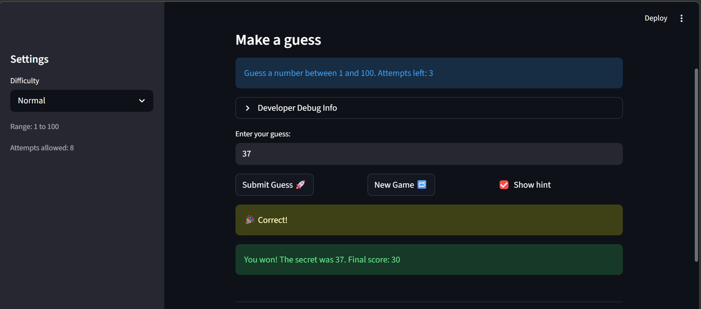

# 🎮 Game Glitch Investigator: The Impossible Guesser

## 🚨 The Situation

You asked an AI to build a simple "Number Guessing Game" using Streamlit.
It wrote the code, ran away, and now the game is unplayable. 

- You can't win.
- The hints lie to you.
- The secret number seems to have commitment issues.

## 🛠️ Setup

1. Install dependencies: `pip install -r requirements.txt`
2. Run the broken app: `python -m streamlit run app.py`

## 🕵️‍♂️ Your Mission

1. **Play the game.** Open the "Developer Debug Info" tab in the app to see the secret number. Try to win.
2. **Find the State Bug.** Why does the secret number change every time you click "Submit"? Ask ChatGPT: *"How do I keep a variable from resetting in Streamlit when I click a button?"*
3. **Fix the Logic.** The hints ("Higher/Lower") are wrong. Fix them.
4. **Refactor & Test.** - Move the logic into `logic_utils.py`.
   - Run `pytest` in your terminal.
   - Keep fixing until all tests pass!

## 📝 Document Your Experience

- [ ] Describe the game's purpose.
  The purpose of the game's is to find logic and use AI to create test to find flaw in your logic and repair them.
- [ ] Detail which bugs you found.
  -The first the submit it didn't create the count by 1
  -After you won the game, if you pressed play again it wouldnt work 
  - lower/ higher
  -Range in diffculty 
- [ ] Explain what fixes you applied.
  - when play agained is pressed it reset everything
  - change the diffcult of hard and easy with normal as a  reference point
  - apon the first click On submit is decrease the attempt by 1 

## 📸 Demo

- [] [Insert a screenshot of your fixed, winning game here]
 
## 🚀 Stretch Features

- [ ] [If you choose to complete Challenge 4, insert a screenshot of your Enhanced Game UI here]
